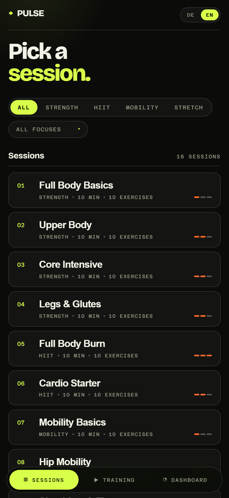
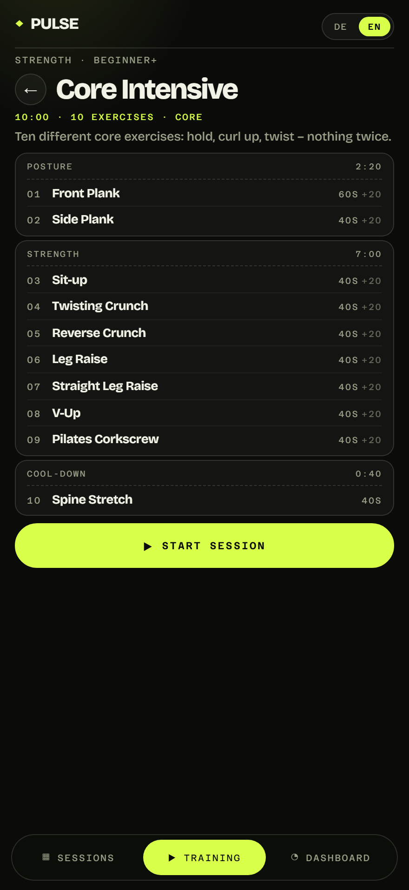
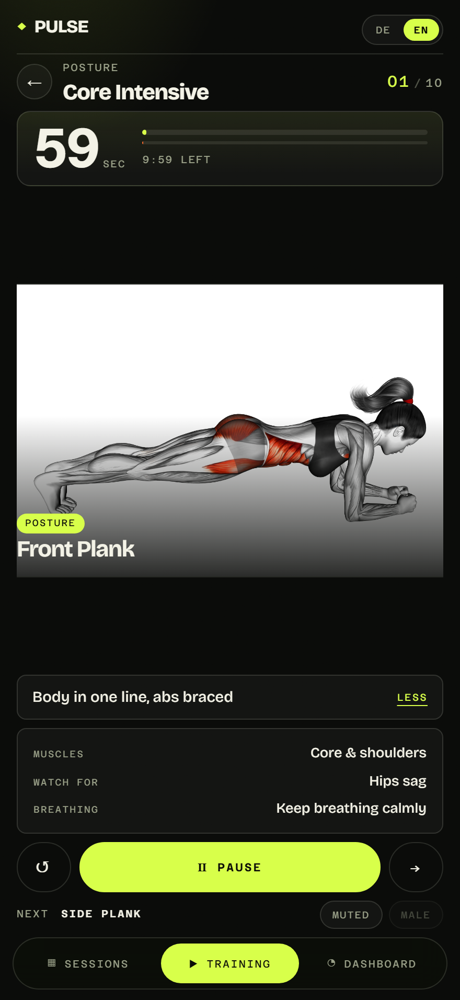
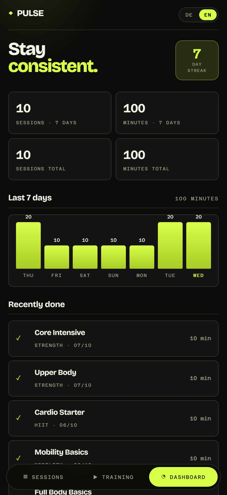

# Pulse — 10-minute bodyweight & mobility training

**16 equipment-free sessions that always fit into ten minutes.** Pick one, press
play, follow the demo video. No account, no ads, no tracking, no build step —
plain HTML, CSS and ES modules.

[](LICENSE)
[](package.json)
[](src/i18n.js)

<p align="center">
  
  
</p>

<p align="center">
  
  
</p>

<p align="center">
  <sub>Library · plan · player · training log — the app on an iPhone 16 Pro Max (440 × 956 CSS px)</sub>
</p>

## What it is

A small training app for the days when you have exactly ten minutes and no
equipment: **no dumbbells, no bench, no pull-up bar, no bands, no step** — every
movement was checked against its demo clip to be doable on the floor, and it
includes a full mobility and stretching line-up next to the strength work. The
app is built for a phone you already own: open it, add it to your home screen,
and it starts like a native app and works offline.

Three things make it more than a video playlist:

- **A fixed rhythm.** Every session is exactly 10:00 — 60 s primer, then 9×40 s
  of work with 20 s of rest in between. The timing is not stored per session, it
  follows from one rule, so no session can drift.
- **Good form, not just movement.** Each exercise carries one cue, the typical
  mistake and a breathing hint, kept deliberately short so you can read it while
  you move.
- **A log that stays.** Streak, last seven days and totals live in the browser —
  optionally exported to a JSON file and restored on another device.

## Live app

**https://typischsinan.github.io/bodyweight-mobility-app/** — runs in any modern
browser, no installation required.

On an iPhone, open the link in Safari → **Share → Add to Home Screen**. The
shortcut then starts without the browser bar, keeps your progress for good (iOS
clears script storage of non-installed sites after seven days) and works without
a network: a service worker keeps the app shell, only the demo clips come from
the CDN — offline, the player shows the still image instead.

## Features

- **Library** with a category switch (Strength · HIIT · Mobility · Stretch) and a
  focus filter (full body, core, upper body, legs, hips, back, shoulders, neck &
  hands, calves & feet), plus intensity and duration per session.
- **Session plan**: every session broken into its blocks (primer → work → core →
  cool-down / flow → holds) with duration per block and `+20` marking the rest
  after each exercise.
- **Player**: 3-2-1 lead-in, drift-free countdown, progress for the current
  exercise *and* the whole session, 20-second rests that already show the next
  exercise as a still image with its own signal, one cue line with a `Details`
  panel (muscles, common mistake, breathing), next exercise, sound toggle and a
  male/female demo switch.
- **Training log**: streak, seven-day chart in minutes, totals and the recent
  sessions, plus backup, restore and reset.
- **Keyboard**: space = start/pause, ← → = previous/next exercise, `R` = restart,
  `Esc` = back. Swiping right goes back as well.
- **Two languages**: full German and English interface, switchable at any time —
  including while a session is running.
- **Careful with the details**: wake lock keeps the screen awake during a
  session, a broken video falls back to the still image with a note, and
  `prefers-reduced-motion` disables the animations.

## How a session is built

Sessions contain **only exercise ids**. The rhythm lives in four constants, which
is why every session has the same length without storing a single timestamp:

```js
export const SESSION_EXERCISES = 10;   // exercises per session
export const PRIMER_SECONDS = 60;      // the first one
export const WORK_SECONDS = 40;        // all others
export const REST_SECONDS = 20;        // rest after every exercise but the last

// 60 + 9×40 + 9×20 = 600 s = 10:00
```

A new session is therefore just a list of blocks:

```js
{ id: "core-intensive", /* … */ blocks: [
  { label: "Haltung", items: [{ id: "front-plank" }] },
] }
```

The English strings for this data live in separate overlay files
(`src/data/en.exercises.js`, `src/data/en.bundles.js`), so the catalog itself
stays free of translation noise.

## Project structure

```
index.html                      markup of all views (library, detail, player, dashboard)
style.css                       design system – dark instrument panel, acid lime, mono digits
manifest.webmanifest            name, colors and icons for the installation
sw.js                           service worker: app shell for the offline start
favicon.svg                     vector favicon (the same diamond as the header)
src/app.js                      state, views, player control, filters, dashboard
src/i18n.js                     UI strings for both languages + the localized data view
src/timer.js                    drift-free session timer (based on timestamps, not ticks)
src/audio.js                    countdown / transition / rest signals via WebAudio (no audio files)
src/storage.js                  training history + settings (localStorage), stats, backup
src/data/exercises.js           exercise catalog: media slug, focus, coaching text
src/data/bundles.js             16 sessions: blocks of exercise ids, rhythm constants
src/data/framing.js             per-exercise video crop (generated by scripts/framing.mjs)
src/data/en.*.js                English display strings for the catalog and the sessions
assets/icons/                   app icons (generated by scripts/icons.mjs)
scripts/dev.mjs                 static server without dependencies
scripts/validate.mjs            checks data, framing, installation and media
scripts/framing.mjs             clip analysis: frame, zoom, pivot per exercise
scripts/icons.mjs               app icon PNGs (Node standard library only)
data/exercise-db-snapshot.json  snapshot of the source dataset (verification fields only)
```

## Run it locally

```bash
npm run dev          # http://127.0.0.1:5173
PORT=4000 npm run dev
```

There is **no build step and no runtime dependency** — only Node ≥ 20 for the dev
server, and no `npm install` is needed.

```bash
npm run validate        # 600 s per session, 10 exercises, 40/20 rhythm, no duplicates,
                        # equipment-free only, framing present, PWA files, translations complete
npm run validate:media  # additionally: every video and poster URL on the CDN answers 200
npm run framing         # recompute the video crops (needs ffmpeg + a one-time `npm install`)
npm run framing -- --only=<slug,...>   # re-measure single exercises only
npm run icons           # generate the app icons in assets/icons (no dependency)
```

Only `npm run framing` needs a dependency (`jpeg-js`, dev-only). The app, the dev
server and `npm run icons` run without `node_modules`.

## Languages

The interface and the whole exercise catalog exist in German and English. The
switch sits in the header, the choice is remembered, and without a stored choice
the app follows the browser language.

Adding a third language means two things: a new overlay pair next to
`src/data/en.exercises.js` and `src/data/en.bundles.js`, and one more entry in
`STRINGS` in `src/i18n.js`. `npm run validate` fails when a translation is
missing, when a text is still German, or when a translated view changes the
structure of a session.

## Design notes

The training views are calculated for the display of an iPhone 16 Pro Max
(440 × 956 CSS pixels):

- **No page scrolling** in the plan and the player — they fill exactly the
  visible height (`body.fit` in `style.css`); only the plan scrolls internally if
  a device leaves even less room.
- **Device edges**: spacing respects `env(safe-area-inset-*)` for the Dynamic
  Island and the home indicator, and the navigation bar sits above it.
- **Largest possible demo window**: the player shows the video edge to edge
  (440 instead of 408 px) while keeping the measured 1.567:1 panel aspect from
  `src/data/framing.js`.
- **Little text, details on request**: each screen shows only what is needed to
  decide or to train. Muscles, mistakes and breathing are one tap away.

## Video framing

The clips are 16:9 with a lot of empty background. `scripts/framing.mjs` measures
every clip across **all frames** (ffmpeg, 6 fps) and derives the global panel
aspect (1.567:1, taller than 16:9), the scene crop and the zoom per exercise — so
the person appears bigger without anything being cut off in any frame. It then
re-checks every frame with a finer threshold and stops if content touches the
edge. `--only=<slug,...>` re-measures single exercises and keeps the rest.

## Media, data and license

Demo videos and posters come from
[`luisaraujoc/free-exercise-db-api`](https://github.com/luisaraujoc/free-exercise-db-api)
(MIT, 317 exercises, a male and a female recording each) and are loaded directly
from their R2 CDN.

**This project's own code is MIT-licensed ([LICENSE](LICENSE)). That does not
automatically cover the embedded media:** the media comes from the source dataset
and its MIT conditions (carry the copyright notice and the license text, no
warranty) continue to apply to that material — reusing it means meeting those
conditions as well. On top of that, the chain of rights for the video material
itself is unclear; the details, the obligations when reusing it and the way to
swap the media are in [ATTRIBUTIONS.md](ATTRIBUTIONS.md). How the sessions are
composed is documented in [BUNDLES.md](BUNDLES.md).

Picking exercises is deliberately conservative: the dataset's `equipment` field
alone is **not** enough, because it labels some exercises `body weight` whose
demo clearly shows a bench, a bar or a band. `npm run validate` therefore checks
twice — against the dataset field *and* against a hand-checked exclusion list
(`NEEDS_APPARATUS` in `scripts/validate.mjs`). [BUNDLES.md](BUNDLES.md) records
how that list came about and which exercises were replaced.

## Known limits

- Without a network the demo video stays empty (the app then shows the still
  image).
- For five exercises — `Front Plank`, `Reverse Crunch`, `Rotational Push-up`,
  `Lying Scissor Kick`, `Pilates Corkscrew` — the dataset only has the female
  recording, so the demo switch is disabled there.
- The English translation is an overlay: the German catalog stays the source of
  truth and the English files only carry display strings.

## License

[MIT](LICENSE) for the code. The media is subject to the conditions of the source
dataset — see [ATTRIBUTIONS.md](ATTRIBUTIONS.md).
